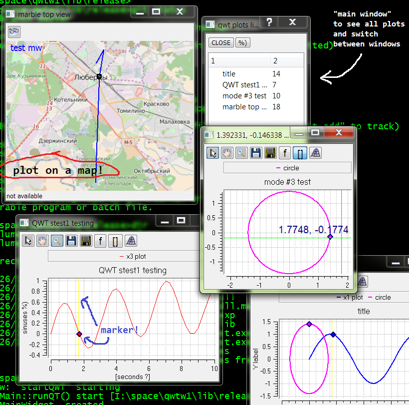

# qwtw
another qwt-based 2D plotting library 

how to build everything:
==========================
install a number of libraries:
-----------------------------
* boost 
* python 2  and cmake
* QT 5
* QWT latest version (6.1.2?) built against QT5
* Marble library for QT5

Windows7 x64
------------
* install BOOST, QT, QWT, python, jom, Visual Studio, Marble packages
* all those packages should 'coinside' with each other: for example 
  QT5 should correspond your VisualStudio, and QWT and Marble - 
  linked with this particular QT5;  may be you'll have to rebuild QWT and Marble for your platform
* go to Visual Studio Command prompt
* make all the DLL be in your PATH (DLL from Boost, QT, QWT, marble....)
* git clone https://github.com/ig-or/qwtw.git qwtw
* cd qwtw\c_lib
* mkdir build
* cd build
* mkdir release
* cd release
* cmake -G "NMake Makefiles JOM" -DCMAKE_BUILD_TYPE=Release ../../.
* jom -j 9
* cd ..\..\..\..\
* cd lib\release
* qwtwtest.exe

library test should start (create 4 very simple plots)

Fedora-24 x64 linux
-------------------------
*  we need latest cmake
  
       sudo dnf install cmake
* we need c++

        sudo dnf install gcc-c++
* QT 5

        sudo dnf install -y `dnf search Qt5 | grep devel | grep x86_64 | grep '^qt5' | awk '{print $1}'`
        PATH=/usr/lib64/qt5/bin:$PATH
* Marble package: 
 
        dnf install -y marble-astro-devel.x86_64  marble-widget-qt5-devel.x86_64
* QWT:

        dnf install -y `dnf search qwt | grep qt5 | grep x86_64 | awk '{print $1}'`
* get the repo:

        git clone https://github.com/ig-or/qwtw.git qwtw
* build everything: 
 
        cd qwtw/qwtw/c_lib
        mkdir build
        cd build
        mkdir release
        cd release
        cmake -G "Unix Makefiles" -DCMAKE_BUILD_TYPE=Release ../../.
        make
        cd ../../../../lib/release
* run test example:

        ./qwtwtest

Authors: Igor Sandler and Anton Klimenkov
